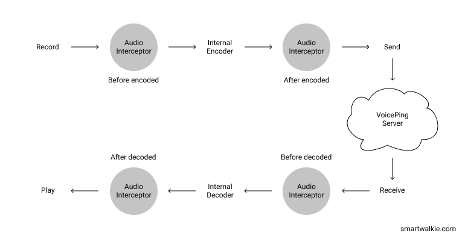

# VoicePing Android SDK

VoicePing Android SDK is an Android library, provided by
[Smart Walkie Talkie](http://www.smartwalkie.com), for enabling Push-To-Talk (PTT) functionality to
your Android project.

<br />  
<center><a href="https://www.voicepingapp.com" target="_blank"></a></center>
<br /><br />

## Walkie Talkie/Push To Talk Android SDK for your Chat Apps

1. Need to add walkie talkie or push-to-talk functionality to your Android app?
2. Worry no more, you can add it quickly with VoicePing Android SDK that works with VoicePing Open Source Router.
3. Simple integration, customizable, and free! What are you waiting for? 🎉

VoicePing Android SDK works together with <span style="text-decoration:underline;"> VoicePing Open Source Router</span> to allow you to quickly add group voice broadcast capability to your app. The Android SDK comes with a reference Android App with UI that demonstrates the one button Push-To-Talk interface.


## Features of VoicePing Android SDK

1. Easy to integrate to your app
2. Low data consumption suitable for Mobile Devices: Opus Codec, defined as 16Khz, 60ms Frame size. ~300KB per 1 minute of speech.
3. Works over all network conditions (2G, 3G, 4G or Wifi)
4. Auto-reconnect feature when Internet connection is lost
5. Uses secure WebSocket for transport
6. Works for Android SDK (16 to 30) and Android OS version 4.1 to 11
7. Low battery consumption


## Use Cases

1. A Uber like application can connect a group of drivers together based on their location or zipcode
2. For Enterprise applications like housekeeping applications, allow a group call to all housekeepers on a certain floor (level) of the hotel
3. For SOS apps, activate voice broadcast if a user is in distress
4. For Chat Apps, allow some users to send instant voice messages that do not need to be manually played.


## Get Started
You can test our sample app here: [Download VP Demo app](https://drive.google.com/file/d/1mI91tOuwPWiYsiU24fQuziiC9bOQRQuI/view?usp=sharing).
The sample app allows you to test the Walkie Talkie function.
Input any user ID and company name. Devices should have same company name to be able to communicate, but different user ID.


## How simple is it to add VoicePing SDK to your app?

<center><a href="https://www.voicepingapp.com" target="_blank"></a></center>

See those mic buttons?

Yup, that button is the only thing you need to add to your app to have PTT functionality.

But what if you don't want a mic button but another UI instead?

We have got it covered. You can customize it.


## Installation

How to install this SDK to your Android project

1. Clone the project
2. Built voiceping-sdk module
3. Add .aar file to your project
4. Sync
5. Use it

## How to use VoicePing Android SDK

### 1. Initialize

Initialize VoicePing in your Application code, inside onCreate method

```kotlin
class VoicePingClientApp : Application() {
    override fun onCreate() {
        super.onCreate()
        VoicePing.init(this, "voiceping_sdk_server_url")
    }
}
```

### 2. Connect

Before you can start talking using PTT, you need connect to server. You can do that by call connect
method from VoicePing instance.

```kotlin
VoicePing.connect("your_user_id", "your_company", object : ConnectCallback {
    override fun onConnected() {
        // Do something
    }

    override fun onFailed(exception: VoicePingException) {
        // Do something
    }
})
```

### 3. Start Talking

After successfully connected, you can now start talking. You can start talking to individual
receiver using,

```kotlin
VoicePing.startTalking("receiver_id", ChannelType.PRIVATE, this)
```

or in a group using,

```kotlin
VoicePing.startTalking("group_id", ChannelType.GROUP, this)
```

### 4. Stop Talking

To stop talking, for both Private and Group PTT, you can use,

```kotlin
VoicePing.stopTalking()
```

### 5. Disconnect

You can disconnect to stop receiving PTT by using,

```kotlin
VoicePing.disconnect(object : DisconnectCallback {
    override fun onDisconnected() {
        // Do something
    }
})
```

### 6. Join a group

You cannot listen to a group channel before joining it. To join a group channel, you can use,

```kotlin
VoicePing.joinGroup("group_id")
```

### 7. Leave a group

To leave a group channel, you can use,

```kotlin
VoicePing.leaveGroup("group_id")
```

### 8. Mute from specific channel

To mute from specific channel, you can use,

```kotlin
VoicePing.mute("target_id", ChannelType.PRIVATE)
// or ChannelType.GROUP if you want to target group
```

### 9. Unmute to specific channel

To unmute to specific channel, you can use,

```kotlin
VoicePing.unmute("target_id", ChannelType.PRIVATE)
// or ChannelType.GROUP if you want to target group
```

## Advance

### Custom audio parameters

You can use custom audio parameters in your app using builder pattern. Instead of directly using

```kotlin
VoicePing.init(this, "voiceping_sdk_server_url")
```

to initialize VoicePing, you can use,

```kotlin
val audioParam = AudioParam.Builder()
    .setUsingOpusCodec(true)
    .setSampleRate(16000)
    .setFrameSize(960)
    .setChannelSize(1)
    .build()
VoicePing.init(this, "voiceping_sdk_server_url", audioParam)
```

### Intercepting audio data



The audio data are represented in array of byte. There are 4 states that are exposed to client app
so that the client app will be able to intercept audio data and do some advance techniques to them.

* Before being encoded (raw audio data)

      audioRecorder.setInterceptorBeforeEncoded(audioInterceptor);

  This state is suitable for doing some advance techniques that require raw recorded audio data,
  such as showing amplitude of the audio, change pitch, etc.

* After being encoded (encoded audio data)

      audioRecorder.setInterceptorAfterEncoded(audioInterceptor);

  If you want to modify audio data after the data being encoded but before being sent to the server,
  you can intercept data in this state. Operation such as encryption that doesn't require raw data
  is suitable in this state.

* Before being decoded (encoded audio data)

      audioReceiver.setInterceptorBeforeDecoded(audioInterceptor);

  Let's say, you have encrypted audio data in previous state, and you want to decrypt them, you can
  use this state to do that.

* After being decoded (raw audio data)

      audioReceiver.setInterceptorAfterDecoded(audioInterceptor);

  If you want to do some advance techniques that require raw received audio data, such as showing
  amplitude of the audio, change pitch, etc, then this state is for you.

1. **OutgoingTalkListener**

To do some advance techniques for the recorded audio, such as showing amplitude of the audio, change
pitch, and save the audio to local storage, you need to implement OutgoingTalkListener and attach it
to ```startTalking```. OutgoingTalkListener is needed to do ```startTalking```,

```kotlin
VoicePing.startTalking("receiver_id", ChannelType.PRIVATE, this)
```

with ```this``` is the instance that has implemented OutgoingTalkListener.

```kotlin
class MainActivity : AppCompatActivity(), OutgoingTalkCallback {

    /**
     * Other class code
     */

    override fun onOutgoingTalkStarted(audioRecorder: AudioRecorder) {
        // Do something after invoking startTalking.
    }

    override fun onOutgoingTalkStopped(isTooShort: Boolean, isTooLong: Boolean) {
        // Do something after invoking stopTalking.
    }

    override fun onDownloadUrlReceived(downloadUrl: String) {
        // Do something after download URL received
    }

    override fun onOutgoingTalkError(e: VoicePingException) {
        // Do something on outgoing talk error.
    }
}
```

You can do a lot of thing by putting your code inside the appropriate methods.

2. **IncomingTalkListener**

To do some advance techniques for the received audio, you need to implement IncomingTalkListener.
IncomingTalkListener is needed to customize incoming talk.

```kotlin
class MainActivity : AppCompatActivity(), IncomingTalkListener {

    override fun onCreate(savedInstanceState: Bundle?) {
        super.onCreate(savedInstanceState)
        VoicePing.setIncomingTalkListener(this)
    }

    // IncomingTalkListener
    override fun onIncomingTalkStarted(
        audioReceiver: AudioReceiver,
        activeChannels: List<Channel>
    ) {
        // Do something after incoming talk started.
    }

    override fun onIncomingTalkStopped(
        audioMetaData: AudioMetaData,
        activeChannels: List<Channel>
    ) {
        // Do something after incoming talk stopped.
    }

    override fun onIncomingTalkError(e: VoicePingException) {
        // Do something on error.
    }
}
```

#### Warning

```AudioInterceptor``` is running on separated thread from Main Thread. If you want to touch UI from
there, you need to run it on Main Thread.


## Customization

You can customize the size, color, of the mic button.
You can also customize the shape of the mic button. Or you can have your own PTT button.

```
<com.smartwalkie.voicepingsdk.VoicePingButton
    android:layout_width="wrap_content"
    android:layout_height="wrap_content"
    app:shape="..." (oval / rectangle)
    app:radius="..."
    app:backgroundColor="..."
    app:micColor="..."
    />
```

## VoicePing server URL

VoicePing Android SDK needs a VoicePing Server to work. You can test with our hosted server.

The public server URL: `wss://router-lite.voiceping.info`


## Self-hosted server

If you need to self-host the server, you can find more documentation on the server repo:

* [VoicePing Server](https://github.com/SmartWalkieOrg/walkie-talkie-server)


## Maintainers

* [VoicePing team](https://www.voicepingapp.com/)


## VoicePing Enterprise

VoicePing Enterprise is the full featured closed source version with support. More features available are [https://www.voicepingapp.com](https://www.voicepingapp.com). You can try VoicePing on:

* [VoicePing Web](https://web.voiceoverping.net/)
* [VoicePing Android](https://play.google.com/store/apps/details?id=com.media2359.voiceping.store)
* [VoicePing iOS](https://itunes.apple.com/us/app/voiceping/id1249953303?ls=1&mt=8)

Join the same public channel ID and try PTT from the web to the Android/iOS app and vice versa. You will find VoicePing has very clear audio and low latency<sup>1</sup>.

VoicePing Enterprise has more features than VoicePing Open Source which can be found here: https://www.voicepingapp.com/blog/design-a-stunning-blog


### Push To Talk

* **Push To Talk (1-1):** Make private calls that no one else can hear.
* **Push To Talk (Group):** Talk to a group of up to 500 users.


### Group Channels

* **Multi Channel Scanning:** Active Channel is switched automatically when someone is talking.
* **Mute Groups:** Silent Groups that you do not need to hear right now.
* **Leave Groups:** Leave Groups to save on Battery.
* **Dynamic Groups:** Add, remove or create new groups from Android or Web App.


### Unified Field Communication

* **Texting:** Send text in VoicePing Mobile or VoicePing Web Texting or Desktop.
* **Text to Speech:** Have text read out to you when you receive them. Supports Multiple Languages.
* **API:** Send automated Text via API. Send Interactive Text with question and answers. Get location. Manage Groups and group members.
* **Send Pictures:** Send HD pictures in VoicePing.
* **Send Videos:** Send 720p Videos (Auto Compressed) in VoicePing.
* **Auto Forward Pictures to Email:** Pictures can be auto forwarded to email for archival or re-sending.
* **Voice/Video Calls:** Make Private Voice/Video Calls using VoIP.


### Headsets

* **Wired Headset Support:** Hear and PTT via Wired Headset with PTT Toggle Mode Button.
* **Bluetooth Headset Support:** Hear Incoming PTT. Best Paired with Bluetooth PTT Button.
* **Bluetooth PTT Button Support:** Activates PTT without needing to touch phone


### Safety

* **Priority Calls:** Override conversation to send urgent messages.
* **SOS:** Gets everyone into the emergency channel quickly.
* **Paging:** Urgent and constant alert to get someone's attention.
* **Default SOS:** Quickly press PTT button five times to send a SOS to a pre-defined channel.


### Recordings

* **Download Group Conversation:** Download as audio, text and picture files of the entire group conversation as company admin.
* **Download Private Conversation:** Download as audio, text and picture files of the entire private conversation between any pair of users.


### Location

* **Live Location Tracking:** See where everyone is now on a map
* **View Historical Location:** See where one person has been
* **Download Location Data:** Download the location data via Excel or API
* **View Location in App:** Admins can view location of users in the Android or Web App


### Multi Platform Support

* **[Android Supported](https://play.google.com/store/apps/details?id=com.media2359.voiceping.store):** Android 5 to Android 11 supported. With or Without Google Services.
* **[iPhone Supported](https://itunes.apple.com/us/app/voiceping/id1249953303?ls=1&mt=8):** iPhone version available. Runs in Background to allow for Real Time receiving of PTT.
* **[Desktop Version](https://www.voicepingapp.com/blog/voiceping-desktop-web-ptt):** Web Based version to connect office and field workers.


## Consulting/Partnership, Services & Pricing

If you would like help on server setup, maintenance, customization, please reach out and we can help you on that. VoicePing Enterprise is also available for customisation, rebranding and source code purchase.


## Footnote

[1] Latency: time between someone talks in a device until the other hears the audio on another device
